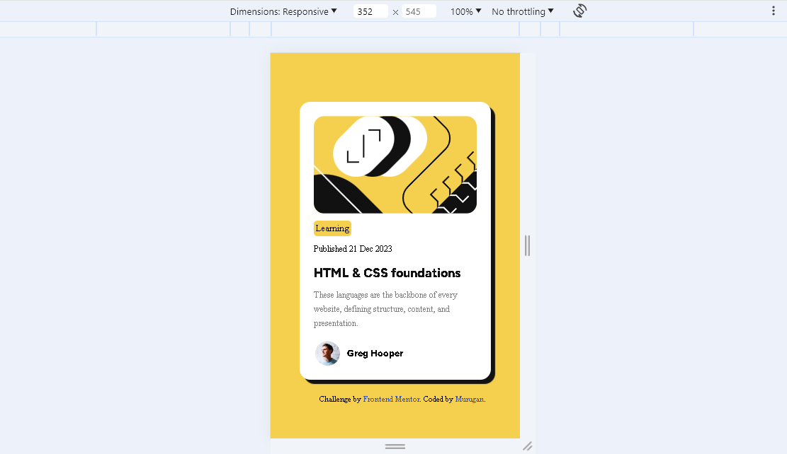
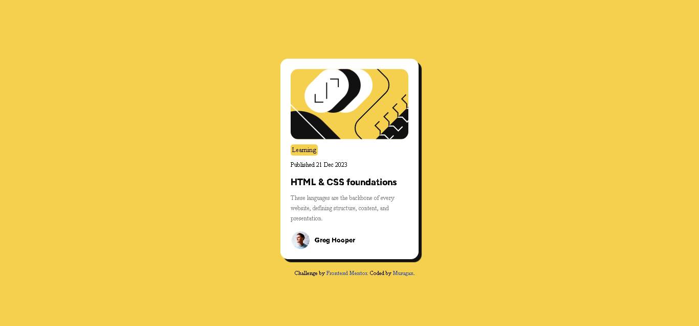

# Blog-Preview-Card
Here I am make a Blog Preview Card webpage(It is a Frontend mentor challenge)
# Frontend Mentor - Blog preview card solution

This is a solution to the [Blog preview card challenge on Frontend Mentor](https://www.frontendmentor.io/challenges/blog-preview-card-ckPaj01IcS). Frontend Mentor challenges help you improve your coding skills by building realistic projects. 

## Table of contents

- [Overview](#overview)
  - [The challenge](#the-challenge)
  - [Screenshot](#screenshot)
  - [Links](#links)
- [My process](#my-process)
  - [Built with](#built-with)
  - [What I learned](#what-i-learned)
- [Author](#author)

## Overview
  I this project i am create blog preview card by using html,css(use flex,downloaded font files, etc,...)
### The challenge

Users should be able to:

- See hover and focus states for all interactive elements on the page

### Screenshot




### Links

- Live Site URL: [Add live site URL here](https://your-live-site-url.com)

## My Process

### Built with

- Semantic HTML5 markup
- CSS custom properties
- Flexbox
- Mobile-first workflow
### What I learned

```css
    #a-img{
        width: min(230px, 100%);
        border-radius: var(--border-radius);
        overflow: hidden;
    }
    #a-img:hover img, #a-img:focus img{
        transform: scale(1.1);
    }
```
## Author

- Frontend Mentor - [@yourusername](https://www.frontendmentor.io/profile/yourusername)

